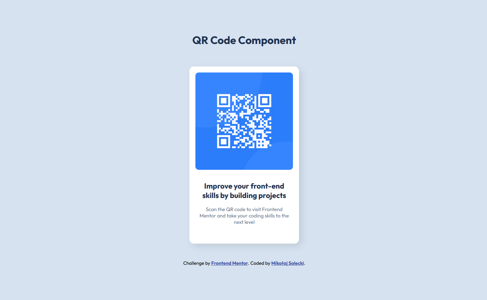

# Frontend Mentor - QR code component solution

This is a solution to the [QR code component challenge on Frontend Mentor](https://www.frontendmentor.io/challenges/qr-code-component-iux_sIO_H). Frontend Mentor challenges help you improve your coding skills by building realistic projects.

## Table of contents

- [Overview](#overview)
  - [Screenshots](#screenshots)
  - [Links](#links)
- [My process](#my-process)
  - [Built with](#built-with)
  - [What I learned](#what-i-learned)
  - [Continued development](#continued-development)
  - [Useful resources](#useful-resources)
- [Author](#author)
- [Acknowledgments](#acknowledgments)

## Overview

### Screenshots

**Template:**

**Finished Version:**

### Links

- Solution URL: [GitHub Repository](https://github.com/123Mikolaj/frontendmentor-QR-code-component/)
- Live Site URL: [GitHub Pages](https://123mikolaj.github.io/frontendmentor-QR-code-component/)

## My process

### Built with

- Semantic HTML5 markup
- CSS custom properties
- Flexbox

### What I learned

Through this project, I learned how to use Flexbox for layout alignment, which allowed me to position the QR code component and header effectively. I also improved my skills in creating a responsive design and working with CSS properties to achieve a clean and modern look.

### Continued development

In future projects, I plan to explore advanced CSS layout techniques and refine my skills in responsive design. I also aim to experiment with CSS Grid for complex layouts and further enhance my understanding of accessibility in web design.

### Useful resources

- [Flexbox Guide](https://css-tricks.com/snippets/css/a-guide-to-flexbox/) - A comprehensive guide on using Flexbox for layout design.
- [MDN Web Docs - HTML5 Elements](https://developer.mozilla.org/en-US/docs/Web/HTML/Element) - A detailed resource on using semantic HTML elements like `<main>`, `<footer>`, and `<header>` to structure your HTML content effectively.

## Author

- Frontend Mentor - [@123Mikolaj](https://www.frontendmentor.io/profile/123Mikolaj)
- LinkedIn - [Mikołaj Solecki](https://www.linkedin.com/in/mikolaj-solecki/)
- GitHub - [@123Mikolaj](https://github.com/123Mikolaj/)
- GitLab - [@mikolaj.solecki.123](https://gitlab.com/mikolaj.solecki.123)

## Acknowledgments

A big thank you to the Frontend Mentor community for providing such valuable challenges. Special thanks to the resources and tutorials that helped guide me through this project.
